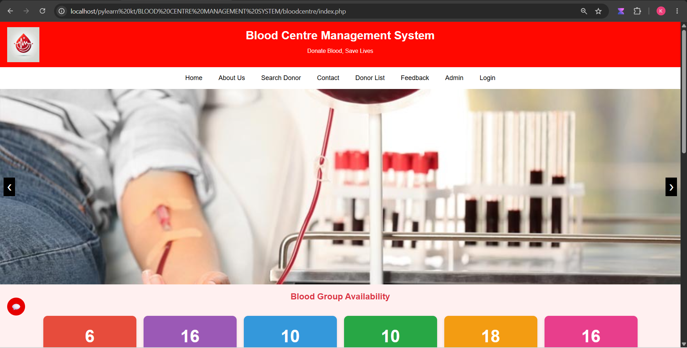
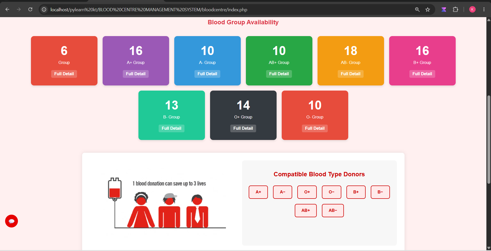
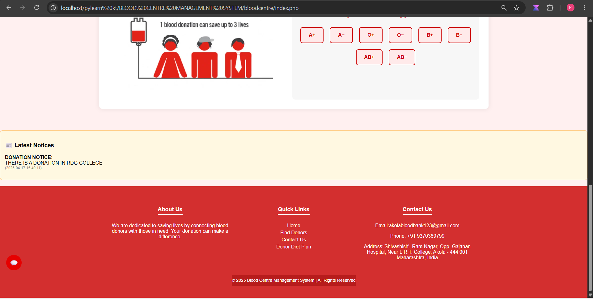
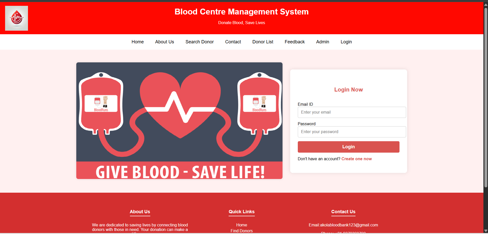
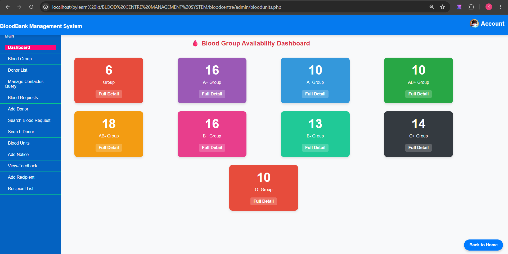
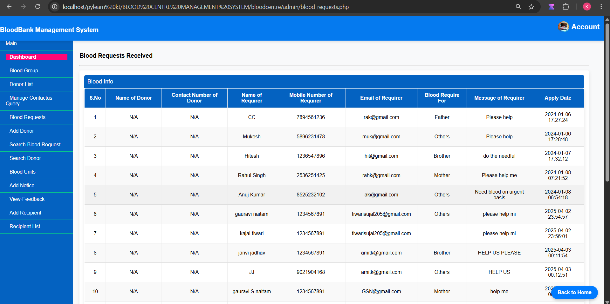
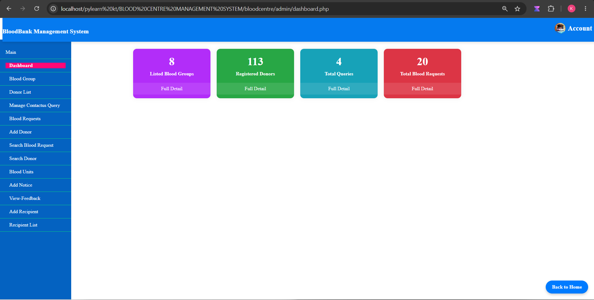
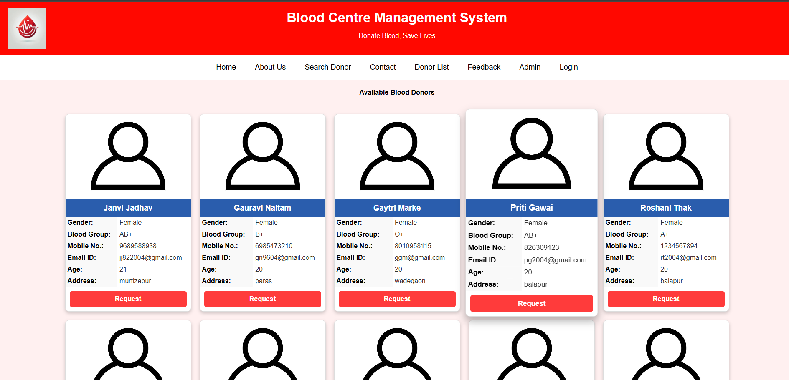
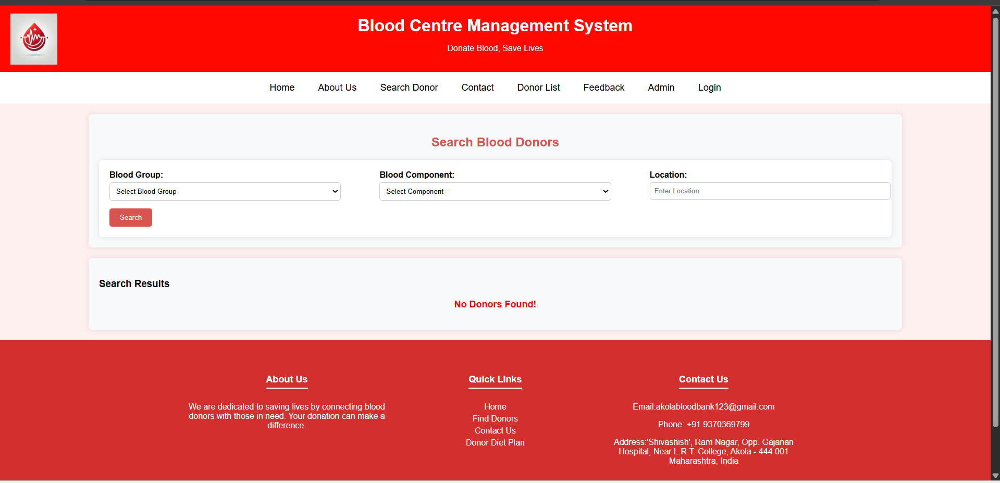
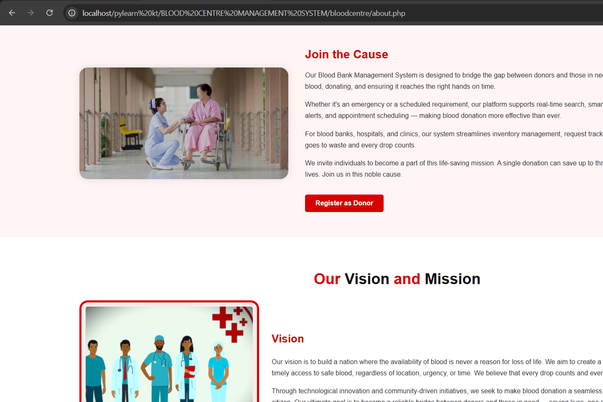

# 🩸 Blood Bank Management System

A web-based **Blood Bank Management System** developed using **PHP, MySQL, HTML, CSS, and JavaScript**. This application helps blood banks and hospitals efficiently manage donors, recipients, blood inventory, and blood requests through an easy-to-use interface.

---

## 📖 Project Overview

The system simplifies blood bank operations by providing modules for donor registration, recipient management, blood inventory tracking, and blood issue management. It also includes an admin panel for monitoring records and generating reports.

---

## 🚀 Features

* 👤 Donor Registration & Management
* 🩸 Blood Inventory Management
* 🏥 Recipient Registration & Management
* 📦 Blood Request & Issue System
* 📊 Blood Availability Tracking
* 📜 Recipient & Donor History
* 💬 Feedback Module
* 🔐 Secure Admin Login
* 📈 Dashboard with Statistics
* 📱 Responsive User Interface

---

## 🛠️ Technologies Used

| Technology | Purpose                   |
| ---------- | ------------------------- |
| HTML5      | Structure                 |
| CSS3       | Styling                   |
| JavaScript | Client-side Functionality |
| PHP        | Backend Development       |
| MySQL      | Database                  |
| XAMPP      | Local Server              |

---

## 📂 Project Structure

```text
Bloodcentre/
│
├── Admin/
├── Images/
├── includes/
├── SQL/
│   ├── bbdms.sql
│   └── bbdms2.sql
│
├── index.php
├── login.php
├── sign-up.php
├── donor_register.php
├── request.php
├── profile.php
├── feedback.php
├── chatbot2.php
├── chatbot-response.php
├── historychart.php
├── contact.php
├── logout.php
└── ...
```

---

## 🗄️ Database

The project uses **MySQL** and includes tables such as:

* `tbldonors`
* `tblrecipients`
* `tblbloodbags`
* `tblbloodissues`
* `tblbloodgroup`
* `tbladmin`

---

## ⚙️ Installation

1. Install **XAMPP**.
2. Copy the project folder into the **htdocs** directory.
3. Start **Apache** and **MySQL**.
4. Open **phpMyAdmin**.
5. Create a new database.
6. Import the SQL file from the `SQL` folder.
7. Open your browser and visit:

```text
http://localhost/Bloodcentre/
```

---

## 📸 Modules

* Admin Dashboard
* Donor Management
* Recipient Management
* Blood Group Management
* Blood Request Management
* Blood Issue Management
* Blood Availability
* Feedback Management
* Reports & History

---

## 🎯 Future Enhancements

* Email Notifications
* SMS Alerts
* Online Blood Request Approval
* Blood Donation Appointment Booking
* PDF Report Generation
* Mobile Responsive Dashboard
----

## 📸 Project Screenshots

### 🏠 Home Page (Section 2)


### 🏠 Home Page (Section 3)


### 🏠 Home Page


### 🔐 Login Page


### 📊 Admin Dashboard


### 📈 Dashboard Analytics


### 📋 Dashboard Reports


### 🩸 Donor List


### 🔍 Search Donor


### ℹ️ About Us


---

## 👩‍💻 Author

Admin Dashboard :
Username :Admin or admin
Password:Test@123

* Kajal Tiwari

